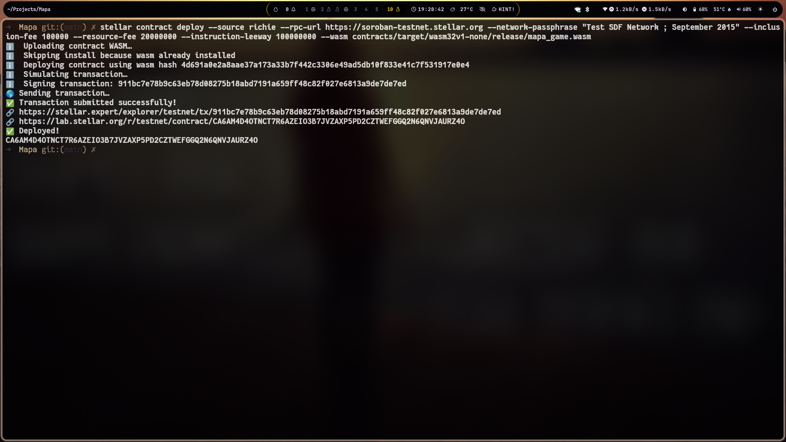
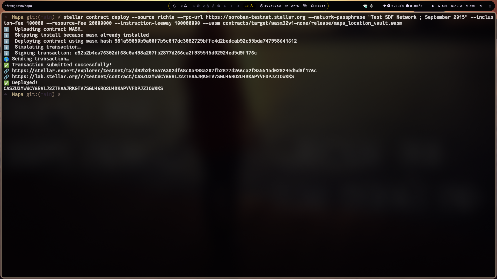

# Mapa — GeoGuessr on Stellar

<p align="center"> <a href="https://mapa-gamma-seven.vercel.app/"><strong>🌍 Live Site →</strong></a> </p>

Mapa is a decentralized geography guessing game built on **Stellar Soroban**. Players guess locations from street view imagery and win prizes in **XLM** — the closer the guess, the bigger the payout.

## How It Works

1. **Connect Wallet** — Link your Stellar wallet (Freighter, xBull, Lobstr, Hana)
2. **See a Location** — Random street view imagery from around the world
3. **Place Your Guess** — Pin your guess on an interactive Google Map
4. **Win Prizes** — The closer you are, the more XLM you earn from the pot

## Architecture

```text
┌─────────────────────┐     ┌──────────────────────┐
│   Next.js Frontend  │     │   Google Maps API    │
│   (React 19)        │────▶│   Street View + Map  │
│                     │     └──────────────────────┘
│  - Wallet Provider  │
│  - Interactive Map  │     ┌──────────────────────┐
│  - React Query      │────▶│   Stellar Soroban    │
│  - Tailwind CSS     │     │   (Game Logic)       │
└─────────────────────┘     │                      │
                            │  - MapaGame          │
                            │  - LocationVault     │
                            └──────────────────────┘
```

## Smart Contracts

### Contract Addresses (Testnet)

| Contract | Address | Explorer |
|----------|---------|----------|
| **MapaGame** | `CANFO7ESVUGOSWGVLSQ6ZJ5H6NYQ5YX3JV7HEOK2K3RFGA75WSUW3MVO` | [View](https://stellar.expert/explorer/testnet/contract/CANFO7ESVUGOSWGVLSQ6ZJ5H6NYQ5YX3JV7HEOK2K3RFGA75WSUW3MVO) |
| **MapaLocationVault** | `CAY2SXEBLCKGQGYB2L257EOLESFDFOKALZV4PYZBH3JXZYM2W2LEMKOB` | [View](https://stellar.expert/explorer/testnet/contract/CAY2SXEBLCKGQGYB2L257EOLESFDFOKALZV4PYZBH3JXZYM2W2LEMKOB) |

### Deployment Screenshots


*MapaGame contract deployed on Stellar testnet*


*MapaLocationVault contract deployed on Stellar testnet*


*Testing Screenshots*

### MapaGame (`contracts/mapa_game/`)

- Game lifecycle management
- Entry fee handling
- Score calculation via Haversine distance
- Prize distribution

### MapaLocationVault (`contracts/mapa_location_vault/`)

- Location storage with lat/lng
- Random location selection
- Token (XLM) deposit, payout, and withdrawal

## Getting Started

### Prerequisites

- Rust + wasm32 target
- Stellar CLI (`stellar`)
- Node.js 20+
- Google Maps API key

### Setup

```bash
# Install contracts
make build-wasm

# Run contract tests
make test

# Install frontend
cd frontend && npm install

# Run frontend
cd frontend && npm run dev
```

### Environment

Copy `.env.example` to `frontend/.env.local` and configure:

| Variable | Description |
|----------|-------------|
| `NEXT_PUBLIC_SOROBAN_RPC` | Soroban RPC endpoint |
| `NEXT_PUBLIC_STELLAR_NETWORK` | `testnet` or `pubnet` |
| `NEXT_PUBLIC_GOOGLE_MAPS_API_KEY` | Google Maps JS API key |
| `NEXT_PUBLIC_CONTRACT_MAPA_GAME` | Deployed game contract ID |
| `NEXT_PUBLIC_CONTRACT_MAPA_LOCATION_VAULT` | Deployed vault contract ID |

## Deployment

```bash
# Deploy to testnet
make deploy

# Deploy to mainnet (requires confirmation)
make deploy-mainnet
```

### CI/CD Pipeline

The project uses GitHub Actions for automated CI/CD (`.github/workflows/`):

| Workflow | Triggers | Jobs |
|----------|----------|------|
| `contracts.yml` | Push/PR to `main`, tags, manual | Build → Test → Integration → Deploy |
| `frontend.yml` | Push/PR to `main` | Build + Lint |
| `deploy.yml` | Tags, manual | Deploy to Vercel |
| `soroban.yml` | Manual | Contract interaction tasks |

The **Contracts** workflow builds both WASM targets, runs unit tests and Node integration tests, and can deploy contracts via `workflow_dispatch` with a configurable target network (`testnet`/`mainnet`). Deployment uses the Stellar CLI binary with `--source-account` (secrets), pinned to Rust `1.84.0` with `wasm32v1-none` target.

## Prize Mechanics

- **Entry fee**: 0.1 XLM per game
- **Score**: 0–1,000,000 based on distance (perfect = 1M, >20km = 0)
- **Prize**: `entry_fee × score / 1,000,000` — closest gets the biggest cut
- **Pot**: Entry fees accumulate and are distributed based on accuracy
