# Mapa — GeoGuessr on Stellar

<p align="center"> <a href="https://mapa-gamma-seven.vercel.app/"><strong>🌍 Live Site →</strong></a> </p>

Mapa is a decentralized geography guessing game built on **Stellar Soroban**. Players guess locations from street view imagery and win prizes in **XLM** — the closer the guess, the bigger the payout.

## Preview

### Promo Video

[mapa-promo.mp4](frontend/public/mapa-promo.mp4) — [Raw on GitHub](https://raw.githubusercontent.com/rylsherdamz-rgb/mapa/main/frontend/public/mapa-promo.mp4)

### Screenshots

| Mobile | Desktop |
|--------|---------|
| 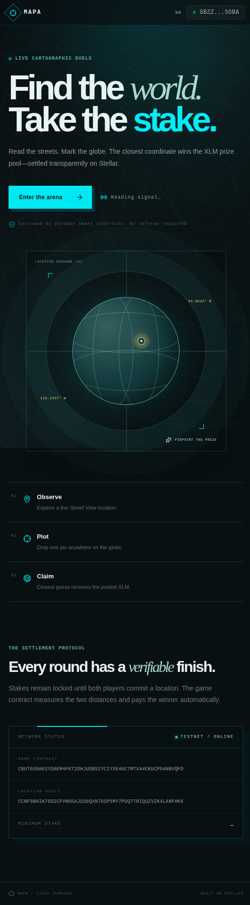 | 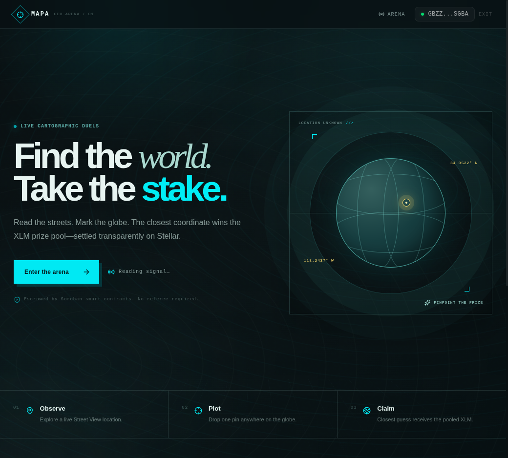 |
| 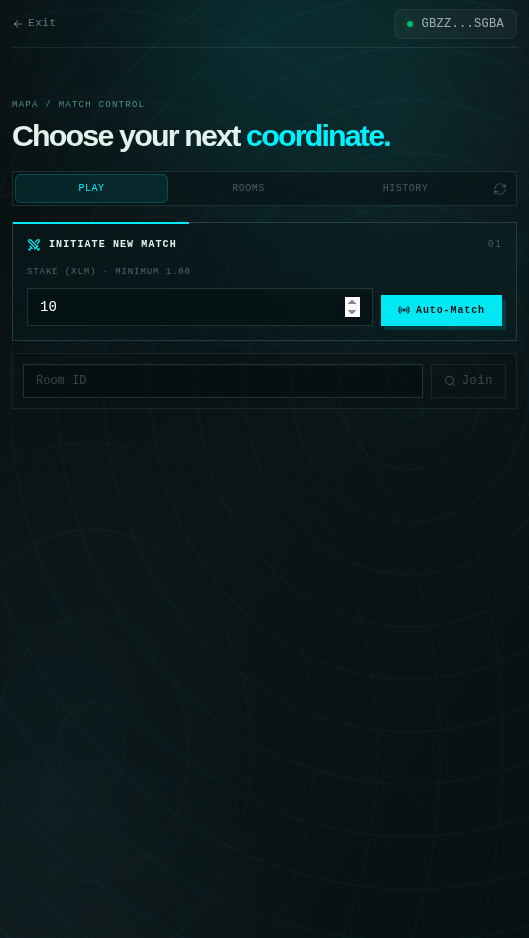 | 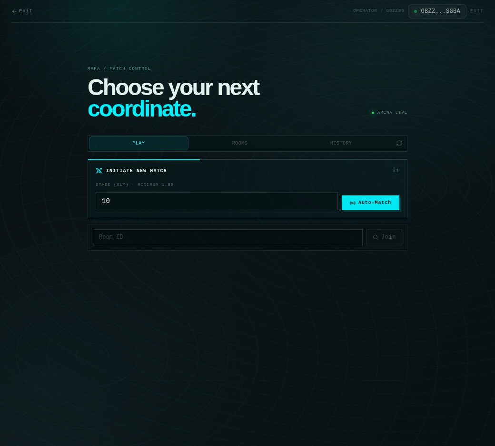 |

### Game States

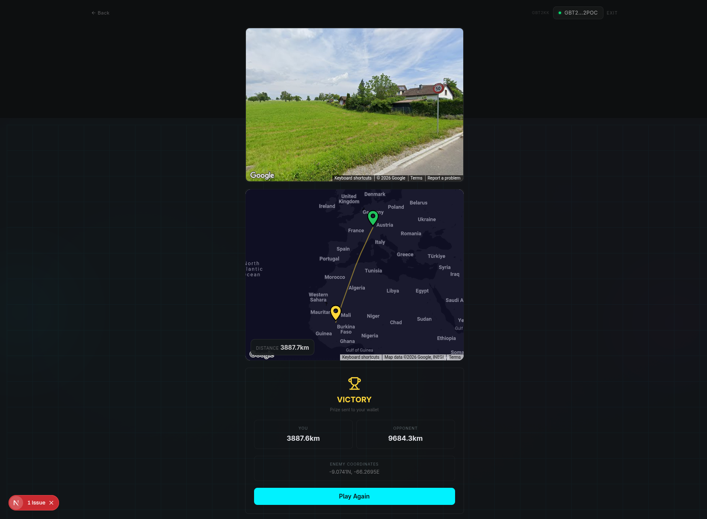
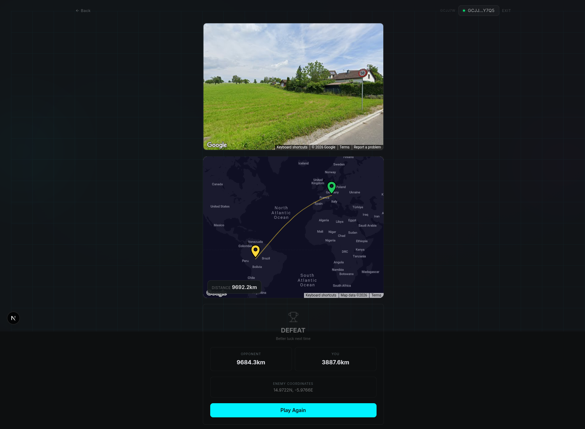
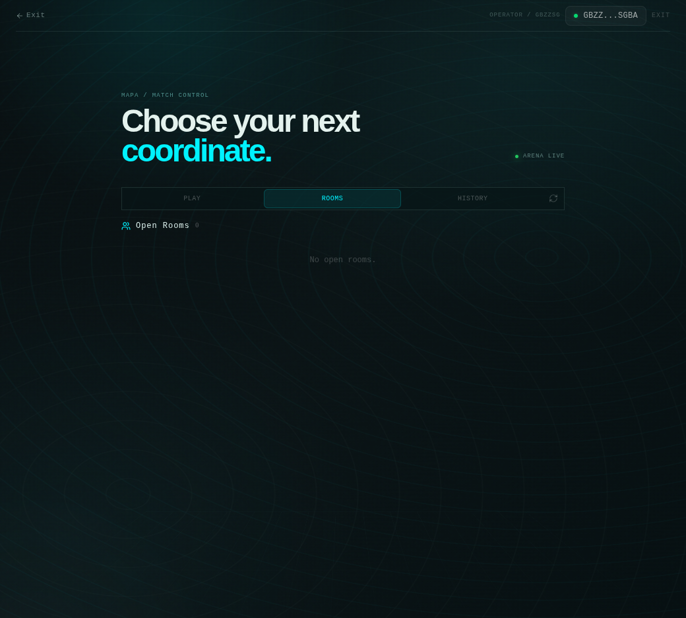
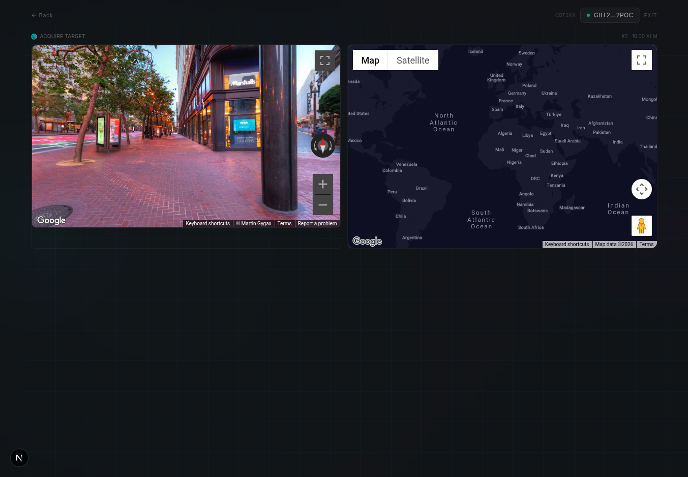
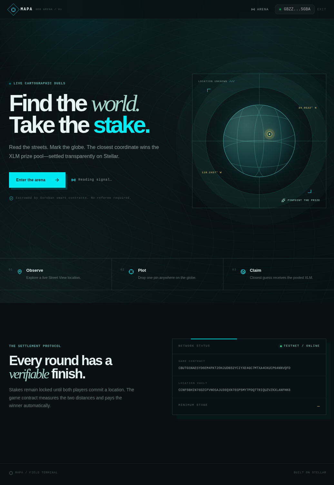

## How It Works

1. **Connect Wallet** — Link your Stellar wallet (Freighter, xBull, Lobstr, Hana)
2. **See a Location** — Random street view imagery from around the world
3. **Place Your Guess** — Pin your guess on an interactive Google Map
4. **Win Prizes** — The closer you are, the more XLM you earn from the pot

## Architecture

```text
┌─────────────────────┐     ┌──────────────────────┐
│   Next.js Frontend  │     │   Google Maps API    │
│   (React 19)        │────▶│   Street View + Map  │
│                     │     └──────────────────────┘
│  - Wallet Provider  │
│  - Interactive Map  │     ┌──────────────────────┐
│  - React Query      │────▶│   Stellar Soroban    │
│  - Tailwind CSS     │     │   (Game Logic)       │
└─────────────────────┘     │                      │
                            │  - MapaGame          │
                            │  - LocationVault     │
                            └──────────────────────┘
```

## Frontend

### Wallet Connection

The frontend connects to Stellar wallets using **`@creit.tech/stellar-wallets-kit`** (multi-wallet) and **`@stellar/freighter-api`** (Freighter direct):

| File | Role |
|------|------|
| `WalletProvider.tsx` | React context providing `publicKey`, `isConnected`, `connect()`, `disconnect()` |
| `WalletConnector.tsx` | Dropdown UI for 4 wallets (Freighter, xBull, Lobstr, Hana) + disconnect |
| `wallet-config.ts` | Kit configuration: `allowedWallets`, `network: testnet`, `modules` |

**Supported wallets:** Freighter, xBull, Lobstr, Hana — all on Stellar testnet.

### Smart Contract Integration

**Location:** `frontend/src/lib/`

| File | Role |
|------|------|
| `stellar.ts` | Creates `rpc.Server` & `Contract` instances; provides network passphrase |
| `soroban.ts` | Core engine: `readContract()` (simulate) and `writeContract()` (prepare → sign → submit → poll) |
| `contract-ids.ts` | Reads `NEXT_PUBLIC_CONTRACT_MAPA_GAME` and `NEXT_PUBLIC_CONTRACT_MAPA_LOCATION_VAULT` from env |
| `game.ts` | Typed wrappers for every contract method |

**Stellar SDK:** `@stellar/stellar-sdk` v16.0.1 — used for `rpc.Server`, `Contract`, `xdr`, and ScVal conversion.

### Contract ↔ Frontend Function Mapping

| Contract Method | Frontend File | Frontend Function | UI Trigger |
|----------------|--------------|-------------------|------------|
| `auto_match` | `game.ts` | `autoMatch()` | /play — Create/Join match |
| `join_room` | `game.ts` | `joinRoom()` | /play — Join specific room |
| `leave_room` | `game.ts` | `leaveRoom()` | /play — Cancel pending room |
| `submit_guess` | `game.ts` | `submitGuess()` | /play — Place location guess |
| `claim_prize` | `game.ts` | `claimPrize()` | /play — Claim winnings |
| `get_room` | `game.ts` | `getRoom()` | /play — Poll room state |
| `get_open_rooms` | `game.ts` | `getOpenRooms()` | Landing, /play — List open rooms |
| `get_player_rooms` | `game.ts` | `getPlayerRooms()` | /play — Load user's rooms |
| `get_min_stake` | `game.ts` | `getMinStake()` | Landing, /play — Display min stake |
| `get_location` | `game.ts` | `getLocation()` | /play — Load street view location |
| `get_random_location` | `game.ts` | `getRandomLocation()` | /play — Pick random location |

## Smart Contracts

### Contract Addresses (Testnet)

| Contract | Address | Explorer |
|----------|---------|----------|
| **MapaGame** | `CCBTZEMT35IPP2VXQ7HTEIXS7J24OEZL4T5S6WQRKKNXCIABMJGXKTQO` | [View](https://stellar.expert/explorer/testnet/contract/CCBTZEMT35IPP2VXQ7HTEIXS7J24OEZL4T5S6WQRKKNXCIABMJGXKTQO) |
| **MapaLocationVault** | `CC4RZMXHGZNGP3XMGXLIXQANIZPZRXWZ6Z63JAFAQA2SBN5QBUBXRCMO` | [View](https://stellar.expert/explorer/testnet/contract/CC4RZMXHGZNGP3XMGXLIXQANIZPZRXWZ6Z63JAFAQA2SBN5QBUBXRCMO) |
| **MAPATST2 Token** | `CD35R3Y5YJFCUKAWEFYKS7NN3QH4PI77YYYSOZWP6LG4KG233DJ6EMXJ` | [View](https://stellar.expert/explorer/testnet/contract/CD35R3Y5YJFCUKAWEFYKS7NN3QH4PI77YYYSOZWP6LG4KG233DJ6EMXJ) |

### Deployment Screenshots

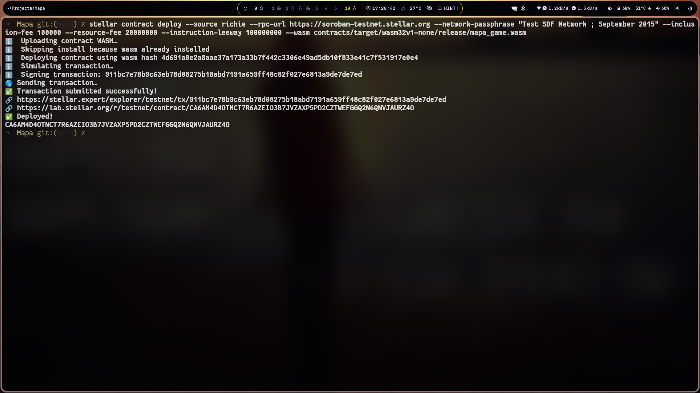
*MapaGame contract deployed on Stellar testnet*

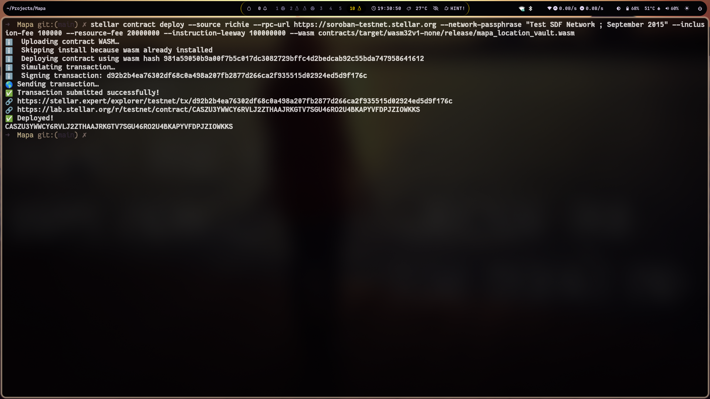
*MapaLocationVault contract deployed on Stellar testnet*


*Test passing*

### MapaGame (`contracts/mapa_game/`)

- Game lifecycle: create room, join, guess, resolve, claim prize
- Entry fee handling via token transfer (MAPATST2)
- Haversine distance calculation with integer math (sin/cos/asin approximations)
- Tie resolution: equal distances refund both players
- Prize distribution: 250bps platform fee, remainder to winner
### MapaLocationVault (`contracts/mapa_location_vault/`)

- Location storage with lat/lng and image reference
- Random location selection
- Admin CRUD for locations

## Testing

### Contract Tests (Rust)

```bash
make test
```

Runs 11 unit tests via `cargo test` covering:
- Room lifecycle (create, join, leave, guess, resolve, claim)
- Auto-match with fee calculation
- Tie resolution (equal distance → both refunded)
- Claim flow (winner and tied rooms)

## Getting Started

### Prerequisites

- Rust + wasm32 target
- Stellar CLI (`stellar`)
- Node.js 20+
- Google Maps API key

### Setup

```bash
# Install contracts
make build-wasm

# Run contract tests
make test

# Install frontend
cd frontend && npm install

# Run frontend
cd frontend && npm run dev
```

### Environment

Copy `.env.example` to `frontend/.env.local` and configure:

| Variable | Description |
|----------|-------------|
| `NEXT_PUBLIC_SOROBAN_RPC` | Soroban RPC endpoint |
| `NEXT_PUBLIC_STELLAR_NETWORK` | `testnet` or `pubnet` |
| `NEXT_PUBLIC_GOOGLE_MAPS_API_KEY` | Google Maps JS API key |
| `NEXT_PUBLIC_CONTRACT_MAPA_GAME` | Deployed game contract ID |
| `NEXT_PUBLIC_CONTRACT_MAPA_LOCATION_VAULT` | Deployed vault contract ID |

## Deployment

```bash
# Deploy to testnet
make deploy

# Deploy to mainnet (requires confirmation)
make deploy-mainnet
```

### CI/CD Pipeline

The project uses GitHub Actions for automated CI/CD (`.github/workflows/`):

| Workflow | Triggers | Jobs |
|----------|----------|------|
| `contracts.yml` | Push/PR to `main`, tags, manual | Build → Test → Integration → Deploy |
| `frontend.yml` | Push/PR to `main` | Build + Lint |
| `deploy.yml` | Tags, manual | Deploy to Vercel |
| `soroban.yml` | Manual | Contract interaction tasks |

The **Contracts** workflow builds both WASM targets, runs unit tests and Node integration tests, and can deploy contracts via `workflow_dispatch` with a configurable target network (`testnet`/`mainnet`). Deployment uses the Stellar CLI binary with `--source-account` (secrets), pinned to Rust `1.84.0` with `wasm32v1-none` target.

## Prize Mechanics

- **Entry fee**: 0.1 MAPATST2 per game
- **Score**: 0–1,000,000 based on distance (perfect = 1M, >20km = 0)
- **Prize**: `entry_fee × score / 1,000,000` — closest gets the biggest cut
- **Pot**: Entry fees accumulate and are distributed based on accuracy
