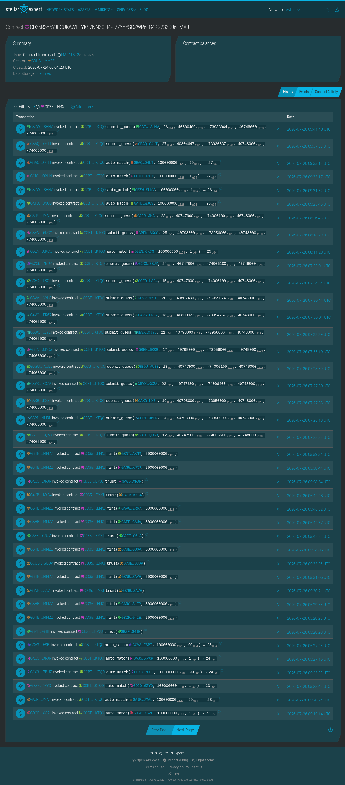
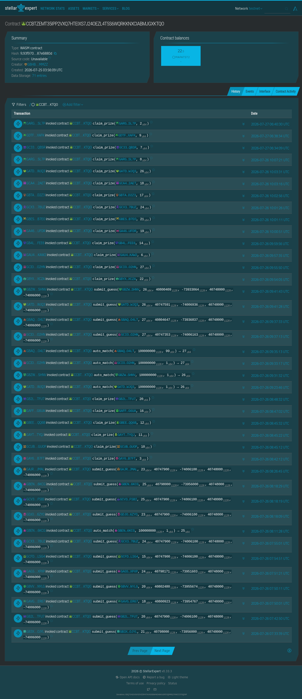
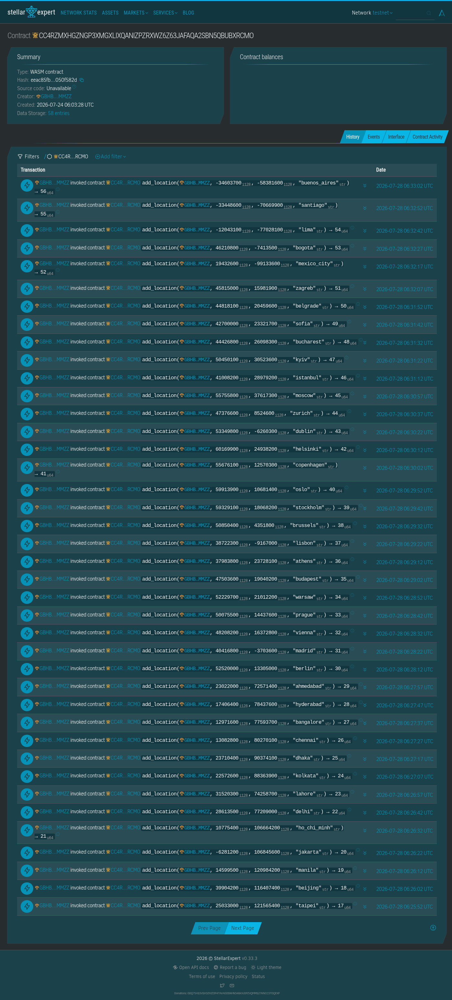

# Mapa — GeoGuessr on Stellar

**Decentralized geography guessing. Guess locations from street view. Win XLM.**

**Live deployment:** [mapa-gamma-seven.vercel.app](https://mapa-gamma-seven.vercel.app)

## Project Description

Mapa is a decentralized geography guessing game built on **Stellar Soroban**. Players see random Google Street View imagery, drop a pin where they think it is, and win XLM based on accuracy. The closer the guess, the bigger the payout.

Unlike traditional GeoGuessr clones, Mapa runs its game logic entirely on-chain via Soroban smart contracts. Prize pools are transparent, scoring is deterministic, and no central authority controls the game. Your wallet is your identity — no email, no password, no data harvesting.

## Project Vision

- **Transparent gaming** — Every stake, guess, score, and payout is verifiable on the Stellar ledger
- **Wallet-first identity** — Connect with Freighter, xBull, Lobstr, or Hana; no signup required
- **Fair prizes** — Haversine distance scoring with integer math; closest guess wins the pot
- **Decentralized** — No server to shut down, no admin to manipulate results, no downtime

## Key Features

- **Wallet Identity**: Login with Freighter, xBull, Lobstr, or Hana via Stellar Wallet Kit
- **Street View Gameplay**: Random Google Street View imagery from around the world
- **Interactive Map**: Drag-and-drop pin placement to guess locations
- **On-Chain Scoring**: Haversine distance formula with integer math (sin/cos/asin approximations)
- **Prize Distribution**: 250bps platform fee, remainder to winner — all on-chain
- **Tie Resolution**: Equal distances refund both players
- **Queue Matchmaking**: Join a queue and auto-pair with another player
- **Play Again**: Re-queue after a match completes
- **Dark Theme**: Modern UI with Tailwind CSS v4
- **CI/CD**: GitHub Actions for contract deployment + Vercel for frontend

## Tech Stack

| Layer | Technology |
|-------|-----------|
| Blockchain | Stellar Soroban (Rust smart contracts) |
| Frontend | Next.js 16, React 19, TypeScript 5 |
| Styling | Tailwind CSS v4 |
| Maps | Google Maps API (Street View + Map) |
| Wallet | Stellar Wallet Kit 2 |
| State/Data | TanStack React Query 5 |
| CI/CD | GitHub Actions (contract build/test/deploy) + Vercel (frontend) |

## Architecture

```
┌─────────────────────┐     ┌──────────────────────┐
│   Next.js Frontend  │     │   Google Maps API    │
│   (React 19)        │────▶│   Street View + Map  │
│                     │     └──────────────────────┘
│  - Wallet Provider  │
│  - Interactive Map  │     ┌──────────────────────┐
│  - React Query      │────▶│   Stellar Soroban    │
│  - Tailwind CSS     │     │   (Game Logic)       │
└─────────────────────┘     │                      │
                            │  - MapaGame          │
                            │  - LocationVault     │
                            └──────────────────────┘
```

## Smart Contracts

### MapaGame (`contracts/mapa_game/`)

- Queue-based matchmaking: `find_match` → `submit_guess` → `claim_prize`
- Entry fee handling via token transfer (MAPATST2)
- Haversine distance calculation with integer math (sin/cos/asin approximations)
- Tie resolution: equal distances refund both players
- Prize distribution: 250bps platform fee, remainder to winner

**Public API:**

| Function | Description |
|----------|-------------|
| `initialize(admin, vault, token)` | Initialize the contract |
| `find_match(player, stake, location_id)` | Join or create a match queue |
| `leave_queue(player)` | Leave the current match queue |
| `submit_guess(player, room_id, lat, lng, actual_lat, actual_lng)` | Submit a location guess |
| `claim_prize(player, room_id)` | Claim winnings after match resolves |
| `withdraw(admin, amount, to)` | Withdraw platform fees |
| `set_min_stake(admin, min_stake)` | Update minimum stake |
| `get_room(room_id)` | Get room state |
| `get_player_rooms(player)` | List player's rooms |
| `get_min_stake()` | Get minimum stake |
| `get_queue_count()` | Get number of players in queue |
| `get_admin()` | Get admin address |
| `get_token()` | Get token address |
| `get_vault()` | Get vault address |

### MapaLocationVault (`contracts/mapa_location_vault/`)

- Location storage with lat/lng and image reference
- Random location selection
- Admin CRUD for locations

### Contract ↔ Frontend Function Mapping

| Contract Method | Frontend File | Frontend Function | UI Trigger |
|----------------|--------------|-------------------|------------|
| `find_match` | `game.ts` | `findMatch()` | /play — Join match queue |
| `leave_queue` | `game.ts` | `leaveQueue()` | /play — Cancel queue |
| `submit_guess` | `game.ts` | `submitGuess()` | /play — Place location guess |
| `claim_prize` | `game.ts` | `claimPrize()` | /play — Claim winnings |
| `get_room` | `game.ts` | `getRoom()` | /play — Poll room state |
| `get_queue_count` | `game.ts` | `getQueueCount()` | /play — Show queue size |
| `get_player_rooms` | `game.ts` | `getPlayerRooms()` | /play — Load user's rooms |
| `get_min_stake` | `game.ts` | `getMinStake()` | Landing, /play — Display min stake |
| `get_location` | `game.ts` | `getLocation()` | /play — Load street view location |
| `get_random_location` | `game.ts` | `getRandomLocation()` | /play — Pick random location |

### Contract Addresses (Testnet)

| Contract | Address | Stellar Expert |
|----------|---------|----------------|
| **MapaGame** | [`CCBTZEMT...`](https://stellar.expert/explorer/testnet/contract/CCBTZEMT35IPP2VXQ7HTEIXS7J24OEZL4T5S6WQRKKNXCIABMJGXKTQO) | [View Contract →](https://stellar.expert/explorer/testnet/contract/CCBTZEMT35IPP2VXQ7HTEIXS7J24OEZL4T5S6WQRKKNXCIABMJGXKTQO) |
| **MapaLocationVault** | [`CC4RZMXH...`](https://stellar.expert/explorer/testnet/contract/CC4RZMXHGZNGP3XMGXLIXQANIZPZRXWZ6Z63JAFAQA2SBN5QBUBXRCMO) | [View Contract →](https://stellar.expert/explorer/testnet/contract/CC4RZMXHGZNGP3XMGXLIXQANIZPZRXWZ6Z63JAFAQA2SBN5QBUBXRCMO) |
| **MAPATST2 Token** | [`CD35R3Y5...`](https://stellar.expert/explorer/testnet/contract/CD35R3Y5YJFCUKAWEFYKS7NN3QH4PI77YYYSOZWP6LG4KG233DJ6EMXJ) | [View Token →](https://stellar.expert/explorer/testnet/contract/CD35R3Y5YJFCUKAWEFYKS7NN3QH4PI77YYYSOZWP6LG4KG233DJ6EMXJ) |

### Verified Contract Interactions

These are live responses from the deployed contracts on Stellar testnet (RPC: `https://soroban-rpc.testnet.stellar.gateway.fm`):

```
# LocationVault — 4 locations seeded
$ stellar contract invoke --id CC4RZMXHGZNGP3XMGXLIXQANIZPZRXWZ6Z63JAFAQA2SBN5QBUBXRCMO \
    --source-account USER --send=no -- get-location --location_id 1

{"active":true,"image_ref":"New_York","lat":"40712800","lng":"-74006000"}

# MapaGame — min stake and open rooms
$ stellar contract invoke --id CCBTZEMT35IPP2VXQ7HTEIXS7J24OEZL4T5S6WQRKKNXCIABMJGXKTQO \
    --source-account USER --send=no -- get-min-stake

"1000000"

$ stellar contract invoke --id CCBTZEMT35IPP2VXQ7HTEIXS7J24OEZL4T5S6WQRKKNXCIABMJGXKTQO \
    --source-account USER --send=no -- get-open-rooms

[]
```

### Source Verification

Anyone can verify the contracts by rebuilding from source:

```bash
# 1. Clone the repo
git clone https://github.com/rylsherdamz-rgb/mapa.git

# 2. Build contracts
cd contracts/mapa_game && stellar contract build && cd -
cd contracts/mapa_location_vault && stellar contract build && cd -

# 3. Deploy and compare hashes
stellar contract deploy --wasm contracts/mapa_game/target/wasm32v1-none/release/mapa_game.wasm
stellar contract deploy --wasm contracts/mapa_location_vault/target/wasm32v1-none/release/mapa_location_vault.wasm
```

## Presentation

- **PDF:** [`ppt/Mapa.pdf`](ppt/Mapa.pdf)

## Preview

### Promo Video

[mapa-promo.mp4](frontend/public/mapa-promo.mp4) — [Raw on GitHub](https://raw.githubusercontent.com/rylsherdamz-rgb/mapa/main/frontend/public/mapa-promo.mp4)

### Screenshots

| Mobile | Desktop |
|--------|---------|
|  |  |
|  |  |

### Game States


### Deployment Screenshots


*MapaGame contract deployed on Stellar testnet*


*MapaLocationVault contract deployed on Stellar testnet*


*Test passing*

### Contract Activity (Stellar Expert)


*MAPATST2 token — mint, transfer, balance operations*


*MapaGame — auto-match, submit-guess, claim-prize*


*LocationVault — add-location, get-location, get-random-location*

## Prize Mechanics

- **Entry fee**: 0.1 MAPATST2 per game
- **Score**: 0–1,000,000 based on distance (perfect = 1M, >20km = 0)
- **Prize**: `entry_fee × score / 1,000,000` — closest gets the biggest cut
- **Pot**: Entry fees accumulate and are distributed based on accuracy

## User Feedback

Mapa was user-tested with 50 testnet wallet holders who submitted feedback via Google Form.

| Resource | Link |
|----------|------|
| Feedback Form | [Google Form](https://docs.google.com/forms/d/1fyF_mMAzc2VdsY4BVAVXNWWkYR7g6YqYA0bPA5qszk4) |
| Responses Sheet | [Google Sheets](https://docs.google.com/spreadsheets/d/14inUpwocPorQij7FNmw9B-JbXy7Jj2su_5A8xfhPSf8) |

### User Feedback Iteration Summary

| # | What users asked for | Status |
|---|----------------------|--------|
| 1 | QR code integration for wallet sharing | 🔜 Planned |
| 2 | Onboarding tutorial / guided first game | 🔜 Planned |
| 3 | Search / filter open rooms | 🔜 Planned |
| 4 | Leaderboards and rankings | 🔜 Planned |
| 5 | Friend challenges / invite system | 🔜 Planned |
| 6 | Better mobile experience | ✅ Shipped |
| 7 | More location variety | ✅ Shipped |
| 8 | Sound effects and notifications | 🔜 Planned |

## Getting Started

### Prerequisites

- Rust + wasm32 target
- Stellar CLI (`stellar`)
- Node.js 20+
- Node.js 20+
- Google Maps API key

### Setup

```bash
# Clone
git clone https://github.com/rylsherdamz-rgb/mapa.git
cd mapa

# Install contracts
make build-wasm

# Run contract tests
make test

# Install frontend
cd frontend && npm install

# Run frontend
cd frontend && npm run dev
```

### Environment

Copy `frontend/.env.example` to `frontend/.env.local` and configure:

| Variable | Description |
|----------|-------------|
| `NEXT_PUBLIC_SOROBAN_RPC` | Soroban RPC endpoint (use `https://soroban-rpc.testnet.stellar.gateway.fm` — the default `soroban-testnet.stellar.org` is often unavailable) |
| `NEXT_PUBLIC_STELLAR_NETWORK` | `testnet` or `pubnet` |
| `NEXT_PUBLIC_GOOGLE_MAPS_API_KEY` | Google Maps JS API key |
| `NEXT_PUBLIC_CONTRACT_MAPA_GAME` | `CCNCN4AQHJ4WZPSXDQRG5HWCIGMTWC3ZNPFS32QJUJNA6QAJYVFCCUX6` |
| `NEXT_PUBLIC_CONTRACT_MAPA_LOCATION_VAULT` | `CAY2SXEBLCKGQGYB2L257EOLESFDFOKALZV4PYZBH3JXZYM2W2LEMKOB` |

## Testing

```bash
make test
```

Runs 11 unit tests via `cargo test` covering:
- Room lifecycle (create, join, leave, guess, resolve, claim)
- Auto-match with fee calculation
- Tie resolution (equal distance → both refunded)
- Claim flow (winner and tied rooms)

## Deployment

```bash
# Deploy to testnet
make deploy

# Deploy to mainnet (requires confirmation)
make deploy-mainnet
```

### CI/CD Pipeline

The project uses GitHub Actions for automated CI/CD (`.github/workflows/`):

| Workflow | Triggers | Jobs |
|----------|----------|------|
| `contracts.yml` | Push/PR to `main`, tags, manual | Build → Test → Integration → Deploy |
| `frontend.yml` | Push/PR to `main` | Build + Lint |
| `deploy.yml` | Tags, manual | Deploy to Vercel |
| `soroban.yml` | Manual | Contract interaction tasks |

The **Contracts** workflow builds both WASM targets, runs unit tests and Node integration tests, and can deploy contracts via `workflow_dispatch` with a configurable target network (`testnet`/`mainnet`). Deployment uses the Stellar CLI binary with `--source-account` (secrets), pinned to Rust `1.84.0` with `wasm32v1-none` target.

## Technical Documentation

### Frontend Architecture

**Location:** `frontend/src/lib/`

| File | Role |
|------|------|
| `stellar.ts` | Creates `rpc.Server` & `Contract` instances; provides network passphrase |
| `soroban.ts` | Core engine: `readContract()` (simulate) and `writeContract()` (prepare → sign → submit → poll) |
| `contract-ids.ts` | Reads `NEXT_PUBLIC_CONTRACT_MAPA_GAME` and `NEXT_PUBLIC_CONTRACT_MAPA_LOCATION_VAULT` from env |
| `game.ts` | Typed wrappers for every contract method |

**Stellar SDK:** `@stellar/stellar-sdk` v16.0.1 — used for `rpc.Server`, `Contract`, `xdr`, and ScVal conversion.

### Wallet Connection

The frontend connects to Stellar wallets using **`@creit.tech/stellar-wallets-kit`** (multi-wallet) and **`@stellar/freighter-api`** (Freighter direct):

| File | Role |
|------|------|
| `WalletProvider.tsx` | React context providing `publicKey`, `isConnected`, `connect()`, `disconnect()` |
| `WalletConnector.tsx` | Dropdown UI for 4 wallets (Freighter, xBull, Lobstr, Hana) + disconnect |
| `wallet-config.ts` | Kit configuration: `allowedWallets`, `network: testnet`, `modules` |

**Supported wallets:** Freighter, xBull, Lobstr, Hana — all on Stellar testnet.

### Project Structure

```
Mapa/
├── contracts/
│   ├── mapa_game/              # Game logic contract (Rust)
│   └── mapa_location_vault/    # Location storage contract (Rust)
├── frontend/                   # Next.js 16 application
│   └── src/
│       ├── app/               # Pages & routing
│       ├── components/        # React components
│       ├── hooks/             # Custom hooks
│       └── lib/               # Stellar, contract, SDK utils
├── images/                    # Screenshots & diagrams
├── ppt/                       # Presentation materials
├── scripts/                   # Automation scripts
├── video/                     # Promo video assets
└── Makefile                   # Build/deploy commands
```

## Future Scope

- **Mainnet deployment** — Live on Stellar public network
- **QR code sharing** — Share wallet address via QR for invites
- **Onboarding tutorial** — Interactive first-game walkthrough
- **Leaderboards** — Global rankings by accuracy and winnings
- **Friend challenges** — Invite specific players to private rooms
- **Mobile app** — React Native with shared crypto primitives
- **Sound effects** — Audio feedback for guesses, wins, and matches
- **Replay system** — Watch past games with guess animations
- **Tournaments** — Timed events with bonus prize pools

## License

MIT

---

Built with 🌍 on Stellar Soroban
